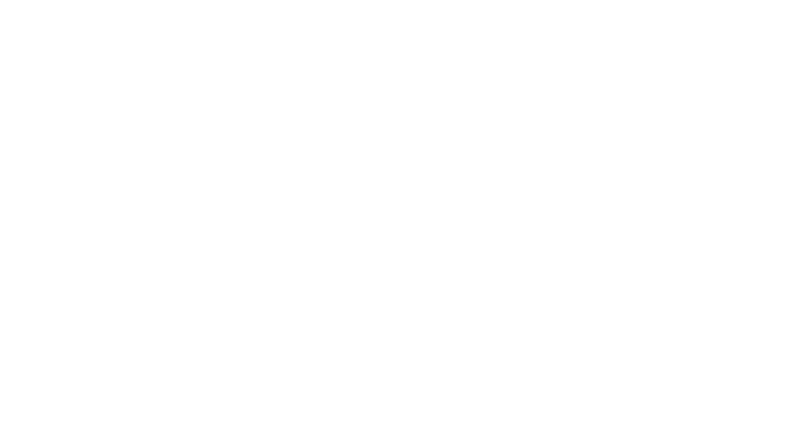

# Kyuri Park's Portfolio
<br>

 Welcome to my portfolio! This project showcases my skills and work as a **front-end developer** and **designer**. The portfolio includes various sections to highlight my **case studies**, **demo reel**, and **contact information**. 


---

## 📂 Project Structure

### Pages 📝

| Page Name       | Description                                                                 |
|-----------------|-----------------------------------------------------------------------------|
| `index.php`     | Landing page featuring projects and a demo reel.                            |
| `about.html`    | Static page providing information about me.                                 |
| `contact.php`   | Page with a form for visitors to contact me.                                |
| `quatro.php`    | Detail page for the Quatro logo and branding project.                       |
| `vybe.php`      | Detail page for the Vybe Pro Max earbuds project.                           |
| `industry.php`  | Detail page for my industry experience and projects.                        |
| `demoreel.php`  | Page showcasing my 2024 demo reel.                                          |
| `thank_you.php` | Thank-you page displayed after form submission.                             |

---

## ✨ Features

1. **Projects Section**:  
   Displays a grid of projects dynamically fetched from a database, including thumbnails, titles, and short descriptions.

2. **Demo Reel**:  
   Highlights my video reel for 2024 with a description and links to my **GitHub**, **Instagram**, and **LinkedIn**. 🎥

3. **Navigation**:  
   Responsive main navigation with an active page indicator. 🧭

4. **Contact Form**:  
   Allows visitors to send messages directly from the site. ✉️

5. **Resume Download**:  
   Provides a downloadable PDF version of my resume. 📄

---

## 💻 Technologies Used

- **Frontend**:  
  - HTML5, CSS3, **SCSS (SASS)**, JavaScript  
  - [GSAP](https://greensock.com/gsap/) for animations 🎞️  
  - [Plyr](https://plyr.io/) for video playback 🎬  
  - FontAwesome for icons ⚙️

- **SASS Usage**:  
  This project utilizes **SCSS (a SASS syntax)** for better management of styles. SCSS variables, mixins, and nesting are used to ensure the CSS is **modular**, **reusable**, and **maintainable**. 🔧

  Example SCSS Variables:
  ```scss
  $primary-color: #5B5B5B;
  $secondary-color: #fff;
  $accent-color: #1E1E1E;
  $orange-color: #EB4E00;
  $main-blue: #008993;
  $body-font-family: "Noto serif", serif;
- **Backend**: 
    - PHP 🖥️
    - MySQL Database 🗃️

## 🛠️ Tools

- Google Fonts (Noto Serif) 🌐
- GitHub for version control 🌐

### Database Configuration:

```php
$servername = "localhost";
$username = "root";
$password = " ";
$dbname = "newportfolio"; 
```


## 📜 History
This project was created as a personal portfolio to showcase my skills in front-end development and design. I started working on this project in 2024 and it has been continuously updated with new projects and features.

## 🎓 Credits
Design: Kyuri Park

Icons: FontAwesome

Animations: GSAP

Video Playback: Plyr

Fonts: Google Fonts - Noto Serif

## 📄 License
This project is licensed under the MIT License. See the LICENSE file for more details.

## 📞 Contact
Feel free to reach out if you have any questions or opportunities! 😊

Email: Hailiepark1216@gmail.com 📧

LinkedIn: https://www.linkedin.com/in/hailie-park-93a6a2328/ 💼

GitHub: https://github.com/KyuriPark00 🖥️